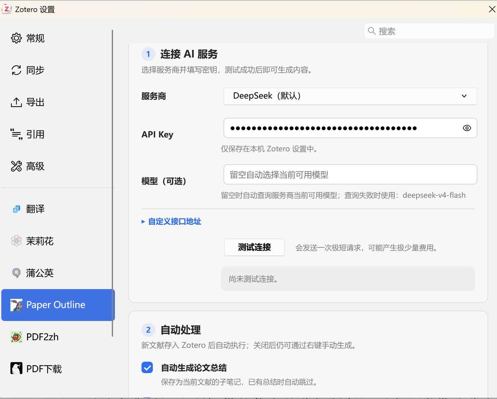

<p align="center">
  
</p>

<h1 align="center">Paper Outline</h1>

<p align="center">
  <strong>让 Zotero 自动读论文：生成整篇总结与可跳转的层级目录。</strong>
</p>

<p align="center">
  新文献入库后自动处理，也支持右键手动生成；扫描论文可先经 MinerU 识别，再继续生成总结和目录。
</p>

<p align="center">
  <a href="https://github.com/DrinkTea905/zotero-paper-outline/releases/latest"></a>
  
  <a href="https://github.com/DrinkTea905/zotero-paper-outline/releases"></a>
  <a href="LICENSE"></a>
  
</p>

<p align="center">
  <a href="https://github.com/DrinkTea905/zotero-paper-outline/releases/latest"><strong>下载安装</strong></a>
  ·
  <a href="#功能介绍">功能介绍</a>
  ·
  <a href="#第一次使用">第一次使用</a>
  ·
  <a href="https://github.com/DrinkTea905/zotero-paper-outline/issues">问题反馈</a>
</p>

---

## Paper Outline 是什么？

Paper Outline 是一个专注、轻量的 Zotero 论文阅读插件。它不提供聊天窗口，而是直接完成阅读前最耗时间的几件事：

- 通读论文并生成结构化的中文整篇总结；
- 提取或生成带页码的层级目录，显示在阅读器左侧大纲栏；
- 点击目录直接跳到正文对应位置，翻页时自动高亮当前章节；
- 遇到只有页面图片的扫描 PDF，可使用 MinerU 识别文字后继续处理；
- 新文献进入 Zotero 后自动处理，也可以按需手动生成；
- 阅读器中的插件界面意外消失时，可从菜单一键重新唤起，无需重启 Zotero；
- 阅读器工具栏直接显示当前文献的题名、作者和年份，并可一键复制题录信息或当前 PDF；
- 把连接测试、模型适配、PDF 文件复制和中文空格清理等高频操作集中到一个插件里。

兼容 **Zotero 7 / 8 / 9**，免费开源。

## 功能介绍

### 1. 可跳转的论文层级目录

打开 PDF 后，Paper Outline 会把论文目录显示在 Zotero 阅读器左侧的大纲栏中：

- 保留一级、二级、三级等真实章节关系；
- 每个章节附带简短中文摘要；
- 点击章节直接跳到正文对应页；
- 阅读时自动高亮当前章节；
- 支持展开、收起和一键重新生成；
- 侧栏收起后再次展开，目录会自动恢复。

插件会优先读取 PDF 自带书签。没有书签时，才从全文生成目录，避免不必要的接口调用。

针对论文前部自带“目录 / 目次”页的情况，定位时会优先寻找正文标题，避免所有章节都跳到第一页；已有的错误页码缓存也会在打开文献时自动修复。

### 2. 整篇论文总结

Paper Outline 会通读全文，生成便于回顾和引用的结构化中文总结，并保存为当前文献的 Zotero 子笔记。

默认总结包括：

- 论文核心研究问题；
- 研究对象与主要观点；
- 研究背景、制度沿革或理论脉络；
- 关键数据、案例和规则；
- 主要论证过程与结论；
- 分级标题、重点加粗和清晰段落。

已有总结时会自动跳过，避免重复生成。目录提示词和总结提示词都可以自行修改，也可以分别点击“恢复默认”。

### 3. 扫描 PDF 也能继续总结

扫描版论文通常只有页面图片，插件看不到可供总结和生成目录的文字。设置 MinerU 后，Paper Outline 会在本地无法读取文字时，把当前扫描 PDF 交给 MinerU 识别，再继续原来的总结和目录流程。

- 普通、已有文字层的 PDF 不会上传；
- 可以选择“扫描件默认上传”，也可以保持关闭、每次上传前确认；
- MinerU Token 只保存在本机 Zotero 设置中；
- Token 有效期为 90 天，插件会按保存时间估算到期日，并在临近到期或可能过期时提醒；
- 设置页可直接检查连接，也可跳转到 MinerU 创建新 Token。

### 4. 新文献入库后自动处理

默认开启自动处理。把带 PDF 的文献保存进 Zotero 后，插件会自动生成：

- 一份整篇总结，保存为子笔记；
- 一份层级目录，显示在阅读器大纲栏。

批量导入时会自动排队并控制并发；已生成过的内容会跳过。关闭自动处理后，仍可通过文库右键菜单手动生成。

### 5. 生成前测试 AI 连接

设置页和阅读器未生成目录的空白栏中，都可以直接点击“测试连接”。

连接成功时会显示：

- 当前实际使用的服务商；
- 实际模型名称；
- 本次请求的响应时间。

连接失败时会尽量转换成容易理解的中文提示，帮助判断 API Key、余额、模型名称或接口地址是否存在问题。

测试会发送一次极短请求，可能产生极少量接口费用。

### 6. 模型自动适配

模型栏可以留空。插件会自动查询服务商当前可用的模型并选择合适模型，不必长期追着服务商的模型改名或下线调整设置。

- 正式生成遇到模型变化时，会刷新模型列表并自动重试一次；
- 手动填写模型名称时，始终尊重用户指定的模型；
- 查询失败时才使用内置兜底模型；
- 自定义中转接口仍可手动填写模型与地址。

### 7. 支持多种 AI 服务

| 服务商 | 说明 |
| --- | --- |
| DeepSeek | 默认选项，模型栏可留空自动查询 |
| OpenAI | 使用 OpenAI 兼容接口 |
| Xiaomi MiMo | 默认 `mimo-v2.5`，支持 1M token 上下文 |
| Kimi / Moonshot | 支持官方接口 |
| 智谱 | 支持官方接口 |
| 通义千问 | 支持官方接口 |
| SiliconFlow | 支持 OpenAI 兼容接口 |
| Ollama | 本地运行，无需 API Key |
| 自定义 | 支持自定义 OpenAI 兼容接口地址 |

### 8. 一次复制多篇 PDF 文件

在 Zotero 文库中单选或多选文献后，可以把本地 PDF **文件本身**复制到剪贴板，再直接粘贴到文件夹、邮件或聊天窗口。

- Windows 支持一次复制并粘贴多份 PDF；
- 支持文库中的 `Ctrl+C` 和右键“复制 PDF 文件”；
- 写入剪贴板后会自动核对文件数量；
- 没有本地 PDF 附件的条目会明确提示；
- 正常复制阅读器文字时，不会被误判成复制 PDF 文件。

这项功能复制的是附件文件，不是题录，也不是 PDF 中的文字。

### 9. 清理中文 PDF 复制空格

部分中文 PDF 复制出来后，字与字之间会夹着大量空格。Paper Outline 提供两种本地清理方式：

- **清理复制文字**：复制中文 PDF 文字后，点击阅读器工具栏中的粉色小猫图标，再粘贴即可得到连续文本；
- **清理全部标注**：在阅读器“注释”栏中，一次清理当前 PDF 所有标注文字和批注中的多余空格。

处理过程只使用本地规则，不调用 AI、不联网、不产生接口费用；英文单词之间的正常空格会保留。

### 10. 一键复制当前文献信息

打开 PDF 后，阅读器工具栏会在粉色小猫旁显示当前文献的 **题名 - 作者 - 年份**。题名过长时会自动省略，鼠标悬停可查看完整内容；右侧提供两个单击按钮：

- **复制信息**：复制完整的“题名 - 作者 - 年份”；
- **复制 PDF**：把当前 PDF 文件放入剪贴板，可直接粘贴到文件夹、邮件或聊天窗口。

例如：`犯罪统计与犯罪治理的优化 - 卢建平 - 2021`

这项功能直接读取当前 PDF 对应的 Zotero 条目，不调用 AI、不联网，也不会修改文献元数据。

### 11. 更清楚的设置界面

设置页按照实际使用顺序整理为 AI 连接、扫描 PDF 识别、自动处理、生成偏好、实用工具、高级设置和帮助等区域：

- 重要设置优先展示；
- 文字层级、间距、按钮和勾选框样式统一；
- API Key 仅保存在本机 Zotero 设置中；
- 高级选项按需展开；
- 深度思考是插件级通用开关，默认关闭，只对已声明支持的内置服务商生效；
- 内置第一次使用、手动生成和故障排查说明。

<p align="center">
  
</p>

## 安装

1. **[下载最新版本 `paper-outline-gpt.xpi`](https://github.com/DrinkTea905/zotero-paper-outline/releases/latest)**。
2. 打开 Zotero，进入 **工具 → 插件**。
3. 点击右上角齿轮，选择 **Install Add-on From File…**。
4. 选择刚下载的 `.xpi` 文件，并按提示重启 Zotero。

插件已经配置自动更新。后续发布新版本时，Zotero 会自动检查并升级。

## 第一次使用

1. 打开 **Zotero 设置 → Paper Outline**。
2. 选择 AI 服务商。
3. 填写 API Key；使用本地 Ollama 时无需 Key。
4. 模型栏建议留空，让插件自动查询当前可用模型。
5. 点击 **测试连接**。
6. 看到绿色“连接成功”后，即可开始生成。

如果希望新文献自动生成总结和目录，保持“自动处理”中的两个开关开启即可。

如果文献中有扫描 PDF，可在同一设置页粘贴 MinerU Token，并点击“检查连接”。是否默认上传扫描件可按自己的隐私习惯选择；关闭时，每次上传前都会询问。

## 日常使用

### 自动生成

把带 PDF 的文献保存进 Zotero。插件会在后台排队生成总结和目录，完成后给出提示。

### 手动生成

- **文库中**：选中一篇或多篇文献，右键选择“AI 整篇总结”或“AI 生成目录”；
- **阅读器中**：打开 PDF，在左侧大纲栏点击“生成目录”；
- **需要重做时**：在大纲栏点击“重新生成”。

### 查看结果

- 整篇总结保存在文献的子笔记中；
- 层级目录显示在阅读器左侧大纲栏；
- 点击目录条目即可跳到相应正文页。
- 工具栏中的文献信息条可直接复制“题名 - 作者 - 年份”。

### 阅读器里的插件界面突然消失

在 Zotero 主窗口点击 **工具 → 重新唤起 Paper Outline**。如果 PDF 在独立阅读器窗口中打开，也可以点击 **查看 → 重新唤起 Paper Outline**。插件会重新挂载当前 PDF 的目录栏和工具按钮，不会重新调用 AI，也不会清除已有目录。

## 常见问题

### 点击生成后没有结果

- 先点击“测试连接”，根据提示检查 Key、余额、模型名称和接口地址；
- 普通 PDF 会直接读取文字；扫描版 PDF 请在设置中填写 MinerU Token；
- 如果提示 Token 到期，请前往 MinerU 重新创建并替换；
- 少数缺少 Unicode 映射的 PDF 会使用 Zotero 全文索引估算页码，可能存在约 ±1 页误差。

### 提示“无法连接 MinerU 结果服务器”

多数用户无需进行额外设置。只有出现这条提示时，才需要检查当前网络：

- 如果正在使用代理、VPN 或网络加速工具，可先暂时关闭后重试；
- 关闭后恢复正常，通常说明 MinerU 识别结果的下载地址被代理影响；
- 请在所用工具的“直连”“绕过代理”或“排除列表”中加入 `cdn-mineru.openxlab.org.cn`；
- 使用 Clash 时，可添加 `DOMAIN,cdn-mineru.openxlab.org.cn,DIRECT`，并使用“规则”模式；其他工具请使用含义相同的直连设置；
- 没有使用代理仍然失败时，可稍后重试、切换网络，或检查安全软件是否限制 Zotero 联网。

### 为什么模型栏建议留空？

服务商可能调整模型名称或下线旧模型。留空时，插件会优先查询当前可用模型并自动适配；需要固定模型时再手动填写即可。

### 为什么已有目录或总结时没有重新生成？

插件默认跳过已有结果，避免重复调用和重复笔记。需要更新时可以点击“重新生成”。

### 数据保存在哪里？

- API Key 保存在本机 Zotero 设置中；
- MinerU Token 及其保存时间保存在本机 Zotero 设置中；
- 整篇总结保存在 Zotero 子笔记中；
- 目录缓存保存在 Zotero 数据目录的 `paper-outline-cache.json`；
- 去空格和 PDF 文件复制功能只在本机处理。

只有在 PDF 没有可读取文字、并得到用户允许或已开启“扫描件默认上传”时，当前 PDF 才会发送至 MinerU 完成文字识别。

## 开发与打包

<details>
<summary>查看开发说明</summary>

```powershell
# Python
python build_xpi.py

# PowerShell
powershell -ExecutionPolicy Bypass -File .\打包.ps1
```

生成文件为 `paper-outline-gpt.xpi`。

主要文件：

```text
paper-outline-plugin/
├─ manifest.json       插件清单
├─ bootstrap.js        生命周期、窗口与阅读器钩子
├─ paperOutline.js     全文、目录、AI、跳页与缓存逻辑
├─ preferences.xhtml   设置页面
├─ preferences.js      设置交互与连接测试
├─ preferences.css     设置页面样式
├─ prefs.js            默认设置
├─ icons/icon.png      插件图标
└─ build_xpi.py        XPI 打包脚本
```

</details>

## 反馈与交流

- 发现问题或希望增加功能：[提交 Issue](https://github.com/DrinkTea905/zotero-paper-outline/issues)
- 分享使用方式或讨论想法：[GitHub Discussions](https://github.com/DrinkTea905/zotero-paper-outline/discussions)

## 许可

[MIT](LICENSE) © 独钓寒江雪。AI 协作开发。
